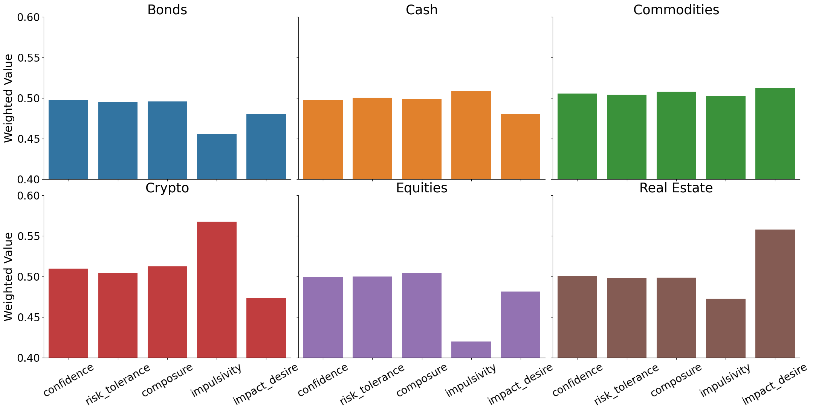

# behavioural-finance

## Overview
This repository explores two datasets of financial investments and investor personality traits. It looks at the distribution of personality traits and correlations between them and with asset type.

## Exploratory Data Analysis

To meaningfully investigate both the assets and personality datasets, it was necessary to convert investments to the same currency. I applied CurrencyConverter on the assets table, computing a GBP value for each asset by using its current value, currency, and date created. 

Figure 1 shows the distribution of traits relating to investor profiles.
For the personality traits confidence, risk_tolerance and composure the distribution was normal. Conversely, impulsivity and impact_desire were not. It is difficult to speculate on the reasons for these differences in distribution without further context as to how these personality traits were measured or their precise definition.

Figure 1 also shows the distribution of total value invested per person (converted to GBP). This roughly follows a normal distribution with a positive skew.
 
Figure 1

I next investigated the distribution of investment into different asset types (Figure 2). 

It can be observed that a large portion of this datasets wealth was invested in Crypto. This is unusual given a typical portfolio holding and suggests that the dataset contains investors with a higher tolerance to risk and volatility. However, this seems contrary to Figure 1, in which risk tolerance was normally distributed.

The amount invested in each currency, was roughly equal, so I investigated the relationship between asset types and the currency used to invest.
 Figure 3 shows graphs, of asset allocation broken into the currency of investment.

One notable finding was EUR was the least used currency to invest in Crypto yet the most for investing in Equities and Bonds, which were the second and third most popular asset class. This finding alligns with broader trends of European investors using a more conservative investment strategy.

Additionally, we can see that AUD was the most used currency to invest in real estate. This is consistent with the Australian cultural tendancy to hold a large portion of wealth in property, reflecting its familiarity and tax advantages.

Exploring the personality dataset, Figure 4, shows a correlation matrix between investor personality traits, and total amount invested (converted to GBP).

There was only small amounts of correlation between GBP invested and personality traits, with most being 0.08 with confidence.

There was a very high (0.92) level of correlation between confidence and risk_tolerance. This finding appears reasonable, as someone more confident in their abilities might favour themselves in risky situations. Given such a high level correlation, it begs the question of the meaningfulness of measuring and including both in the data.

Composure was found to have moderate correlation with confidence and risk_tolerance and there only were small correlations between other personality traits.

Focusing on combining both datsets, it seemed relevant to examine the average personality profiles of investors by the asset type they invest in. 

Figure 5 shows weighted average personality traits of investors, based on total investment in each asset class. For impulsivitiy, we can see investment in Bonds and Equities are associated with lower values whilst Crypto was asscoaited with a higher value. 

Notably, impact_desire seemed also significantly greater for investors within real estate. This might be explained by investors in such areas more likely requiring active engagement, with matters such as repairs and improvements. This could indicate an investor who is more commited and therefore more in desire of a their investment being impactful.

### Quick Start
Made with python 3.11

Please make a virtual environment, and then `pip install -r requirements.txt`

The code for this project can be run in `behavioural-finance.ipynb`

The analysis in the README can also be found in `data_insights.pdf`
